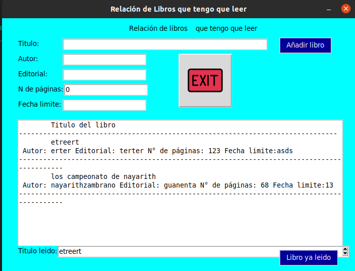

## appLibros
### esta app nos sirve como bien lo dice para leer libros, cuando estamos leyendo y queremos hacer una pausa  lo podremos guardar poniendo el numero de la pagina donde quedamos con una fecha limite de recordatorio y asi cuando volvamos abrir la app este nos recordara el nombre del libro que estamos leyendo y su numero de pagina.
